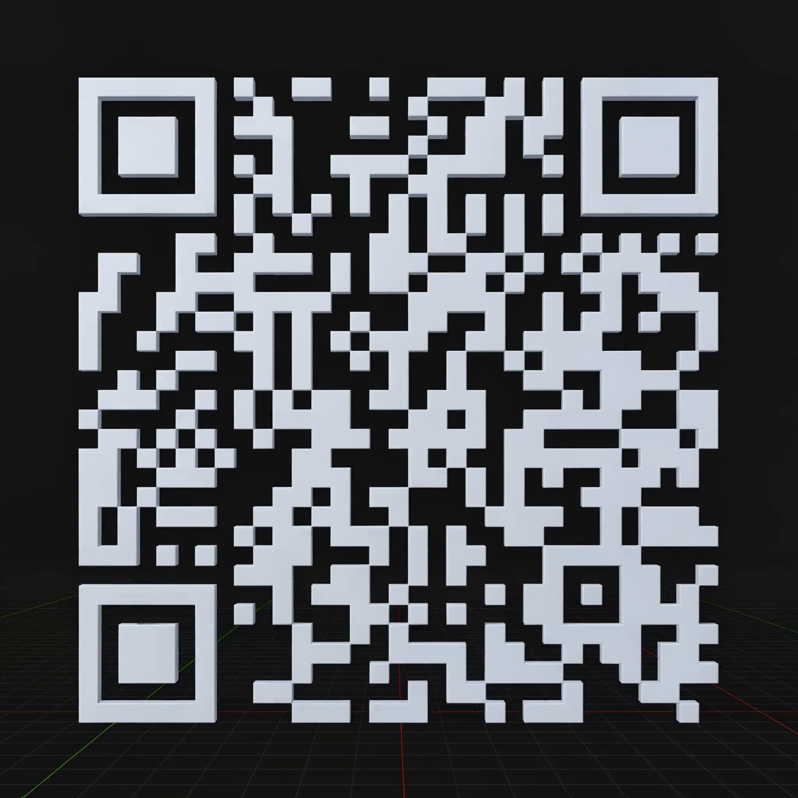
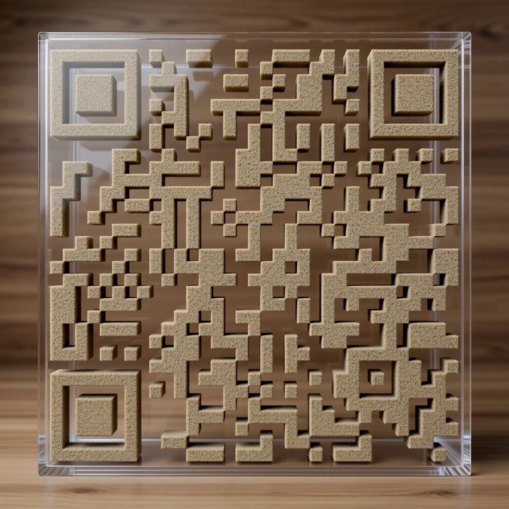
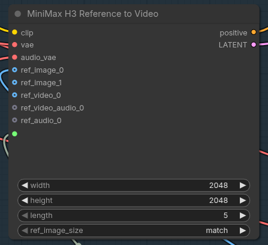

# 3D QR Code Video Generation

Turn a flat QR code into a Blender-style 3D first-frame, then restyle it as polished pink marble and a sand QR inside a glass ant-farm.

Every workflow is a near-stock copy of the official MiniMax H3 **reference-to-video** ([`video_minimax_h3_r2v.json`](https://github.com/Comfy-Org/workflow_templates/blob/main/templates/video_minimax_h3_r2v.json)), no custom plugins, minimal edits.

### 1. Create the QRCode

Generate the QR bitmap with [`qrencode`](https://github.com/fukuchi/libqrencode):

```bash
qrencode -o qrcode.png -s 36 -l H "https://example.com"
```

<details>
<summary>qrcode.png</summary>


</details>

### 2. Generate the Blender-style video

- Load `workflows/qrcode_3d_blender.json` in ComfyUI.
- Set `ref_image_0` to `imgs/qrcode.png`.
- Use the prompt from `prompts/blender_qr_prompt.txt`.
- Run, then download the resulting video.
- Extract its first frame with [`ffmpeg`](https://ffmpeg.org):

```bash
ffmpeg -i video.mp4 -ss 00:00:00 -vframes 1 qr_blender_first_frame.png
```

The extracted first-frame is the Blender-style reference every other style uses as `<Picture 1>`.

### 3. Restyle from the 3D first-frame

Feed the Blender first-frame as the reference image into the remaining two workflows:

| Style | Workflow | Prompt | Output first-frame |
| ----- | -------- | ------ | ------------------ |
| Pink Marble | `workflows/qrcode_marble.json` | `prompts/blender_pink_marble_prompt.txt` | `imgs/qr_marble_first_frame.png` |
| Ant-Farm (sand) | `workflows/qrcode_antfarms.json` | `prompts/antfarm_sand_no_ants_prompt.txt` | `imgs/qr_antfarms_first_frame.png` |

## Results

**Base** — Blender-style first-frame: matte light-gray 3D blocks on the grid:



**Pink marble** — polished pink marble on black marble:


**Ant-farm** — sandstone QR inside a glass box on a wood background:



## Node configuration

| Parameter         | Value   |
| :---------------- | :------ |
| `width`           | `2048`  |
| `height`          | `2048`  |
| `length`          | `5`     |
| `ref_image_size`  | `match` |



## Repository structure

```
.
├── README.md
├── imgs/
│   ├── qrcode.png                    # base QR bitmap (step 1)
│   ├── qr_blender_first_frame.png    # step 2 — Blender 3D
│   ├── qr_marble_first_frame.png     # step 3 — pink marble
│   ├── qr_antfarms_first_frame.png   # step 3 — ant-farm / sand
│   └── config.png                    # MiniMax H3 node settings
├── prompts/
│   ├── blender_qr_prompt.txt
│   ├── blender_pink_marble_prompt.txt
│   └── antfarm_sand_no_ants_prompt.txt
└── workflows/
    ├── qrcode_3d_blender.json
    ├── qrcode_marble.json
    └── qrcode_antfarms.json
```

## Credits

- [MiniMax H3 — reference-to-video template](https://github.com/Comfy-Org/workflow_templates/blob/main/templates/video_minimax_h3_r2v.json)
- [MiniMax H3 model](https://www.minimax.io/blog/minimax-h3) · [Comfy-Org/MiniMax-H3](https://huggingface.co/Comfy-Org/MiniMax-H3)
